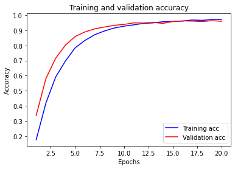

# udacity_self-driving
 the nanodegree projects for self-driving

## Step1)  first download the training data 
   download the image data of GTSRB(The German Traffic Sign Recognition Benchmark) from http://benchmark.ini.rub.de/?section=gtsrb&subsection=dataset
   all image resize to the same size of (32,32)
   
## Step2) show a random sample from each class of the traffic sign dataset 
   2.1) before training, shuffle all data into random order, then
   2.2) divide data into two parts: train data and test data
   
## Step3 create a small CNN neural network   
   this network is small, the whole parameters in only 64,811, far less than 1 million
   as we could see from NN description below, the input data for first layer is image arrays, which covoluted (32,32,3) image to (28,28,6) 
   there is a dropout layer before last output result, which decrease the overfitting
    _________________________________________________________________
    Layer (type)                 Output Shape              Param #   
    =================================================================
    conv2d_6 (Conv2D)            (None, 28, 28, 6)         456       
    _________________________________________________________________
    max_pooling2d_6 (MaxPooling2 (None, 14, 14, 6)         0         
    _________________________________________________________________
    conv2d_7 (Conv2D)            (None, 10, 10, 16)        2416      
    _________________________________________________________________
    max_pooling2d_7 (MaxPooling2 (None, 5, 5, 16)          0         
    _________________________________________________________________
    flatten_3 (Flatten)          (None, 400)               0         
    _________________________________________________________________
    dense_9 (Dense)              (None, 120)               48120     
    _________________________________________________________________
    dense_10 (Dense)             (None, 84)                10164     
    _________________________________________________________________
    dropout_3 (Dropout)          (None, 84)                0         
    _________________________________________________________________
    dense_11 (Dense)             (None, 43)                3655      
    =================================================================
    Total params: 64,811
    Trainable params: 64,811
    Non-trainable params: 0
    _________________________________________________________________
   
## Step4 after Compile this NN , begin to Train
    the training data divide into training and validation, of 30%, the last parameter shows : validation_split=0.3
    the whole training time only 12.56 second on my GTX2080, since the network is small, and input image also small
    though this NN is small, but is works well, it reaches more than 95% at Epoch 10/20, and accuracy reaches at 0.9807 at last

## Step5 test on the trained model performance on test data

        
